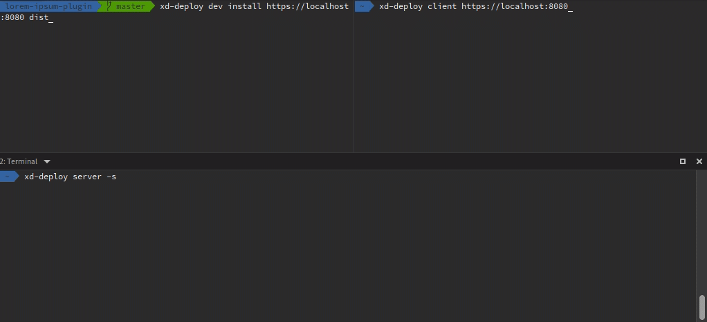
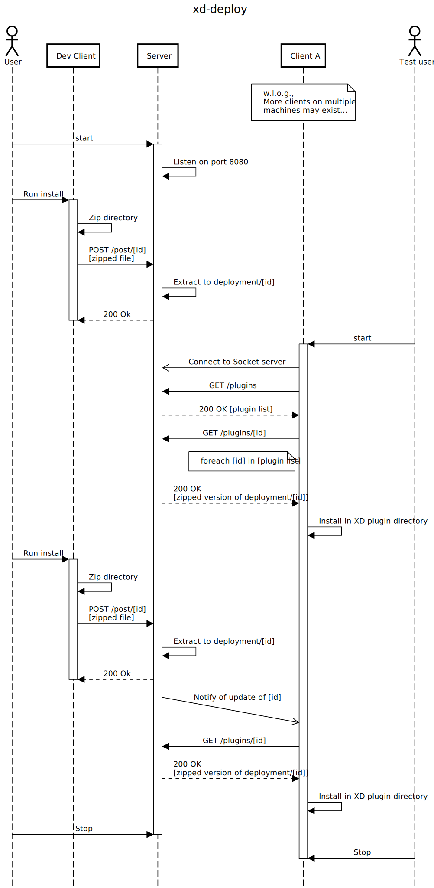

# xd-deploy

```bash
npx @pklaschka/xd-deploy <command>
```

A toolbelt for easy and quick, iterative plugin development for Adobe XD allowing quick deployment to multiple test machines, making testing your plugin super easy.



### Installation
```bash
npm install -g @pklaschka/xd-deploy
```

or

```bash
yarn add -g @pklaschka/xd-deploy
```

resulting in the `xd-deploy` binary getting addet to the *PATH*.

### Concept

There are three parts:

1. The "Server" serves the plugins to test machines from a folder. This can, but doesn't have to be the development machine, but *must* be accessible via the network.
   The server can be any machine, i.e., run under macOS, Windows or Linux.

2. The "Dev Client" can get used when the server isn't the development machine. It automates "deploying" to the server, which then distributes the plugin to all clients.
   The developer client can also run on any machine, allowing XD plugin development on Linux machines, too.

3. The "Clients" run on test machines with XD installed. It connects to the server and keeps all plugins in sync with the server version. Furthermore, whenever an update for a plugin gets distributed by the server, the client automatically installs it and Reloads the plugins inside XD, making it extremely easy to test after making changes.
   The client can get run on macOS, WIndows, and the Windows Subsystem for Linux (WSL). It requires XD to be installed on the machine.

## A visualization with one server, one client and a dev client


